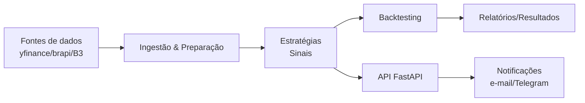
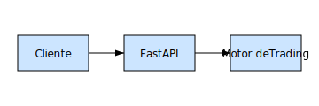

# Swing Trade B3

[](https://github.com/leotavo/swing-trade-b3/actions/workflows/ci.yml)
[](https://github.com/leotavo/swing-trade-b3/actions/workflows/codeql.yml)
[](https://github.com/dependabot)
[](LICENSE)
[](pyproject.toml)
[](https://github.com/leotavo/swing-trade-b3/milestone/1)
[](CONTRIBUTING.md)
[](https://github.com/leotavo/swing-trade-b3/issues)
[](https://github.com/leotavo/swing-trade-b3/stargazers)
[](https://github.com/leotavo/swing-trade-b3/network/members)
[](https://github.com/leotavo/swing-trade-b3/commits)
[](https://github.com/psf/black)
[](https://codecov.io/gh/leotavo/swing-trade-b3)
[](https://github.com/leotavo/swing-trade-b3/wiki)
[](https://github.com/leotavo/swing-trade-b3/releases)
[](https://github.com/leotavo/swing-trade-b3/milestones)

> **TL;DR**
```bash
git clone https://github.com/leotavo/swing-trade-b3 && cd swing-trade-b3
poetry install && cp -n .env.example .env || true
poetry run uvicorn app.main:app --reload
# smoke-test
curl -fsS http://localhost:8000/docs >/dev/null && echo "API OK"
```

> Automatizar operações de Swing Trade na B3 (Bolsa de Valores do Brasil) usando dados históricos e indicadores técnicos para gerar sinais de compra e venda, testar estratégias e acompanhar resultados.

## Quickstart

```bash
make dev
curl -fsS http://localhost:8000/healthz | jq .
```

Saída esperada:

```json
{"status": "ok"}
```

## Índice

- [Quickstart](#quickstart)
- [Visão Geral](#visão-geral)
- [Status do Projeto](#status-do-projeto)
- [Recursos](#recursos)
- [Arquitetura](#arquitetura)
- [Estrutura do Projeto](#estrutura-do-projeto)
- [Como Começar](#como-começar)
  - [Pré-requisitos](#pré-requisitos)
  - [Instalação](#instalação)
  - [Configuração](#configuração)
- [Uso](#uso)
- [Testes](#testes)
- [Observabilidade](#observabilidade)
- [Roadmap](#roadmap)
- [Stack Tecnológica](#stack-tecnológica)
- [Contribuindo](#contribuindo)
- [Comunidade e Suporte](#comunidade-e-suporte)
- [Licença](#licença)
- [Aviso Legal](#aviso-legal)

## Visão Geral

O projeto visa construir um agente capaz de operar swing trade automatizado utilizando indicadores técnicos e dados históricos da B3.

## Status do Projeto

Status atual: **M1 – Community & CI em progresso**

[](https://github.com/leotavo/swing-trade-b3/milestone/1)

## Recursos

- API REST com [FastAPI](https://fastapi.tiangolo.com/)
- Coleta e preparação de dados históricos da B3
- Estratégias configuráveis de entrada e saída
- Backtesting para validação de estratégias
- Integração futura com alertas e paper trading

## Arquitetura

O sistema é dividido em módulos independentes que tratam coleta de dados, geração de sinais, backtesting e exposição de API. Essa separação facilita a manutenção e a transparência de cada etapa do pipeline.





## Estrutura do Projeto

```
├── app/            # Interface REST com FastAPI
├── swing_trade/    # Lógica de trading e utilitários
├── tests/          # Testes automatizados
├── README.md       # Documentação principal
└── Agents.md       # Roadmap e instruções
```

## Como Começar

### Pré-requisitos

- [Python 3.11](https://www.python.org/)
- [Poetry](https://python-poetry.org/)

### Instalação

Após clonar o repositório, instale as dependências com:

```bash
poetry install
```

Como alternativa, o projeto pode ser instalado em modo editável com `pip`:

```bash
pip install -e .
```

Para gerar um arquivo `requirements.txt` compatível com `pip`, utilize:

```bash
poetry export -f requirements.txt --output requirements.txt --without-hashes
```

### Configuração

Crie um arquivo `.env` na raiz do projeto para variáveis sensíveis (tokens de API, chaves etc.). Nenhum valor é obrigatório no MVP, mas o uso de variáveis de ambiente garante transparência sobre a configuração.

## Uso

Se você utilizou o **Quickstart**, o servidor já estará em execução em `http://localhost:8000`.

Para iniciar manualmente, execute:

```bash
make run
```

Teste o endpoint inicial com:

```bash
curl http://localhost:8000/
```

Acesse `http://localhost:8000/docs` para explorar os endpoints disponíveis.

## Testes

Execute a suíte de testes com:

```bash
make test
```

## Observabilidade

A aplicação FastAPI expõe endpoints de observabilidade:

- **Healthcheck:** `GET /healthz` → `{"status": "ok"}`
- **Métricas Prometheus:** `GET /metrics` (OpenMetrics; scrape por Prometheus/Grafana Agent)

### Teste rápido (local)
```bash
# saúde geral
curl -fsS http://localhost:8000/healthz | jq .

# primeiras linhas das métricas
curl -fsS http://localhost:8000/metrics | head -n 20
```

As métricas incluem CPU, memória e latência HTTP. Em produção, configure o scrape do Prometheus para `http://<host>:<port>/metrics`.

## Roadmap

- [ ] M1 - Configuração Inicial
- [ ] M2 - Coleta e Preparação de Dados
- [ ] M3 - Estratégia Base Swing Trade
- [ ] M4 - Backtesting Inicial
- [ ] M5 - Notificações e Monitoramento
- [ ] M6 - Ajuste de Parâmetros e Otimização
- [ ] M7 - Modelo de ML Básico
- [ ] M8 - Paper Trading
- [ ] M9 - Observabilidade Básica
- [ ] M10 - Segurança e Compliance
- [ ] M11 - Documentação e Guias
- [ ] M12 - Validação Final do MVP

Para uma lista detalhada de tarefas e milestones, consulte o arquivo [Agents.md](Agents.md).

## Stack Tecnológica

Consulte o documento [TECH_STACK.md](TECH_STACK.md) para a lista completa de tecnologias utilizadas no projeto.

## Contribuindo

Leia o [CONTRIBUTING.md](CONTRIBUTING.md) para saber como colaborar com o projeto.

## Comunidade e Suporte

- Consulte o [Código de Conduta](CODE_OF_CONDUCT.md).
- Dúvidas e sugestões: use as [Issues](https://github.com/leotavo/swing-trade-b3/issues) conforme o guia de [Suporte](SUPPORT.md).
- Reporte vulnerabilidades seguindo a [Política de Segurança](SECURITY.md).

## Licença

Este projeto é licenciado sob os termos da licença MIT. Veja o arquivo [LICENSE](LICENSE) para mais detalhes.

## Aviso Legal

Este software é disponibilizado somente para fins educacionais. Ele não constitui recomendação de investimento e os autores não se responsabilizam por perdas financeiras decorrentes de seu uso.
